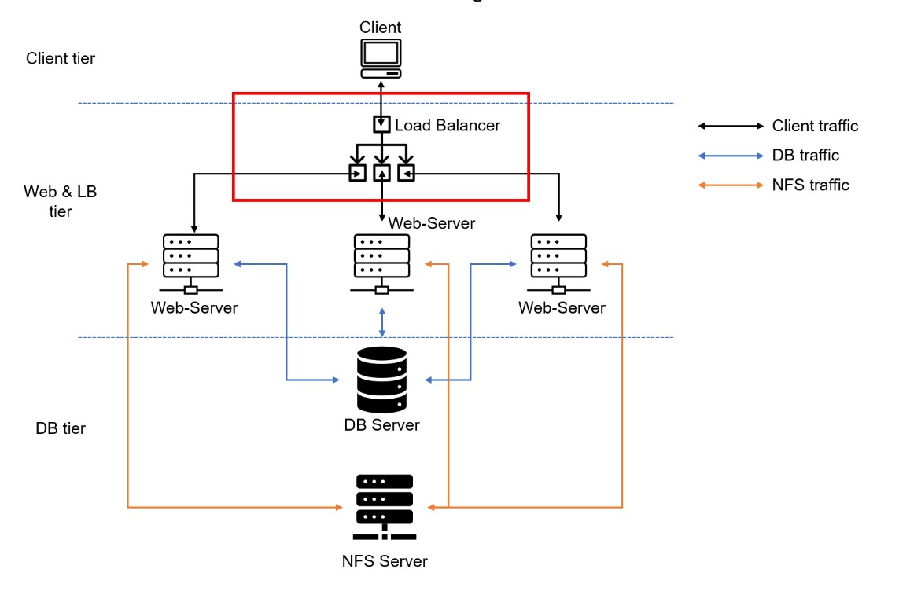

# Load-balancer-with--Apache

This project is a continuation of [devops-tooling-web-solution project](https://github.com/olaniyi2oguns/Devops-tooling-web-solution.git) in which we created a storage server (NFS) to create easy communication between three different webservers.

It will not be ideal to be giving different domain name to the same company website just because the website has different web servers that are responding to customer request. Therefore, in this project we are creating another server whose ip address or domain name will be used to grap information from the web servers to give response to customers request. 

This new server is "LOAD BALANCER" which helps to distribute clients requests among the backend servers and make sure that loads are distributed optimally. 

The picture below shows the architecture of the the solution



Step 1

Ensure that all the webservers, the NFS server and the database servers are up and running.

Follow the guidline for configuring webserver-1 in [devops-tooling-web-solution project](https://github.com/olaniyi2oguns/Devops-tooling-web-solution.git) to configure webserver-2

Step 2

Lunch a new instance of ubuntu 20.04 linux O.S and opening port 80 in the security group.

# configure apache as a load balancer

Run the following commands one after the other to install apache2 and all its dependencies:

`sudo apt update`

`sudo apt install apache2 -y`

`sudo apt-get install libxml2-dev`


`sudo a2enmod rewrite`

`sudo a2enmod proxy`

`sudo a2enmod proxy_balancer`

`sudo a2enmod proxy_http`

`sudo a2enmod headers`

`sudo a2enmod lbmethod_bytraffic`

`sudo systemctl restart apache2`

then, check if apache2 is up and running 

`sudo systemctl status apache2`


Step 3

# Configure load balancing

open the apache2 configuration file and configure it to send and request information from the webservers `sudo vi /etc/apache2/sites-available/000-default.conf`

Paste in this:

```
#Add this configuration into this section <VirtualHost *:80>  </VirtualHost>

<Proxy "balancer://mycluster">
               BalancerMember http://<WebServer1-Private-IP-Address>:80 loadfactor=5 timeout=1
               BalancerMember http://<WebServer2-Private-IP-Address>:80 loadfactor=5 timeout=1
               ProxySet lbmethod=bytraffic
               # ProxySet lbmethod=byrequests
        </Proxy>

        ProxyPreserveHost On
        ProxyPass / balancer://mycluster/
        ProxyPassReverse / balancer://mycluster/
```

Restart apache2 with command `sudo systemctl restart apache2`

Test if your configuration is working by trying to access the "Load balancer public ip address"

`http://<Load-Balancer-Public-IP-Address-or-Public-DNS-Name>/index.php` in your browser.

If you are able to access the website as shown in the image below, then I greet you congratulations you have just implemented a Load balancing web Solution 


